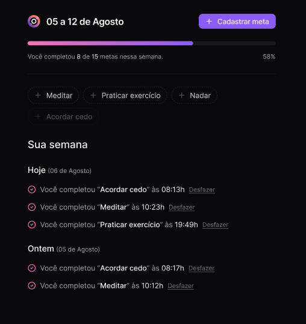

<h1 align="center">
  
  in.orbit - Front end
</h1>


## 💻 Projeto

A aplicação web do **In Orbit** permite que os usuários acompanhem e gerenciem seus hábitos e metas ao longo da semana de forma intuitiva e responsiva. A aplicação oferece uma interface clara para visualizar metas realizadas e pendentes, além de permitir ajustes na frequência e nos detalhes das metas criadas.

Com ele é possível:

- Criar e gerenciar metas e hábitos
- Visualizar o progresso ao longo da semana ou de um dia
- Monitorar a frequência das metas ao longo da semana
- Ver a quantidade de metas totais realizadas

Para visualizar a interface no Figma, [clique aqui](https://www.figma.com/community/file/1415093862269754302/nlw-pocket-js-in-orbit).

<p align="center">
  <kbd>
    
  </kbd>
</p>

## ✨ Tecnologias

- [React](https://reactjs.org/) - Biblioteca JavaScript para construção de interfaces de usuário
- [TypeScript](https://www.typescriptlang.org/) - Superset do JavaScript que adiciona tipagem estática
- [Zod](https://zod.dev/) - Utilizado para validação de dados do formulário
- [React Query](https://react-query-v3.tanstack.com/) - Biblioteca para gerenciamento de estado assíncrono e cache de dados de requisições
- [React Hook Form](https://react-hook-form.com/) - Utilizado para gerenciar e validar formulários

## 🔥 Iniciar a aplicação

Antes de iniciar, certifique-se de que o [backend](https://github.com/Brendon3578/node-in-orbit-server) esteja rodando corretamente. Para iniciar o frontend, siga os passos abaixo:

```bash
# Instalar as dependências
npm install

# Iniciar a aplicação em ambiente de desenvolvimento (http://localhost:5173)
npm run dev
```

---

<h3 align="center">
    Feito com ☕ por <a href="https://github.com/Brendon3578"> Brendon Gomes</a>
</h3>
